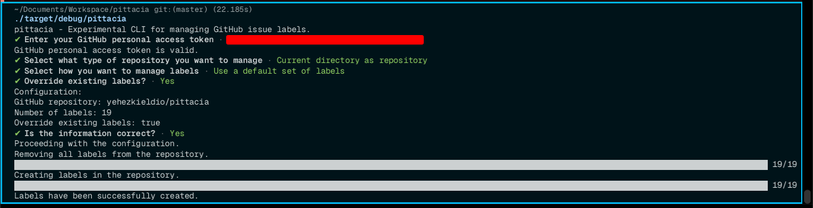

<h3>pittacia</h3>

Experimental CLI for managing GitHub issue labels. 

## Overview

`pittacia` is a Rust-based experimental CLI to quickly create and manage GitHub issue labels. It loads labels from a JSON file and applies them to a GitHub repository. It can also remove all labels from a repository. 

`pittacia` etymologically derives from the ancient Greek word "πιττάκια" (pittakia), it referred to small tablets or pieces of wood on which one might write notes or short messages. These were essentially small writing tablets.

This is a experimental project and is not intended for production use, hence I don't have a published crate for this project, but you can clone this repository and build it locally. 

This project also serves as a learning project for me to learn Rust.

## Usage

## License 

This project is licensed under the MIT License - see the [LICENSE](LICENSE) file for details.